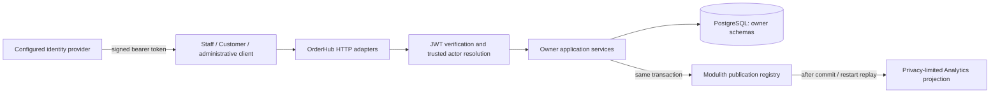

# Architecture and consistency

OrderHub runs as one Spring Boot process with one PostgreSQL transaction manager.
Modules expose named application interfaces; adapters own HTTP, JDBC and
framework integration. Domain and application invariants are independently
testable. `OrderHubModularityTests` verifies the actual dependency graph through
Spring Modulith; narrower architecture tests protect exposed interfaces.

## System context

The identity provider issues tokens; OrderHub fetches public keys only from
operator-configured JWK endpoints. The API is not an OAuth authorization server.
There is no outbound webhook worker or public event feed.

## Ownership map

| Module | Owns | Key consumers / boundaries |
| --- | --- | --- |
| `users` | Provider-neutral User, external binding, TenantMembership and identity lifecycle | Security resolves identity; Workforce/Customers use narrow lifecycle contracts |
| `tenants` | Tenant identity and operational state | Security eligibility; Platform administration |
| `organizations` | Organization lifecycle and Tenant placement | Platform/Organization coordination using owner APIs |
| `authorization` | Permission catalog, roles, grants, envelopes, overrides and decisions | Explicit Staff, Customer-owned and administrative use cases |
| `security` | JWT validation, authenticated principal and trusted Tenant adaptation | HTTP adapters; no ownership of business permissions |
| `workforce` | Staff, placement, position ceilings, delegation, provisioning and owner audit | Authorization source and bounded Analytics source |
| `customers` | Customer account binding and ownership relationship | Customer self-service Orders; no general Customer creation HTTP API |
| `catalog` | Products, variants, categories, attributes, base prices and revision evidence | Inventory validates identity; Orders checks orderability |
| `inventory` | Positions, policy, commitments, movements and policy evidence | Orders joins commitment to its transaction |
| `orders` | Order state and create-operation idempotency | Customer create/read API; coordinates Catalog and Inventory |
| `analytics` | Typed operational facts, pseudonym mapping and admitted retention | Consumes bounded Workforce source after durable notification |
| `administration` | Thin HTTP coordination | Calls owner interfaces; does not become a shared domain or schema owner |
| `bootstrap` | One-shot retained first-operator ceremony state and evidence (ADR-0022) | Offline command only; composes Users and Authorization owner contracts; nothing depends on it |
| `api` | OpenAPI composition metadata | Reflects HTTP handlers; no persistence/business mutation |

Schemas follow ownership rather than arbitrary request grouping. PostgreSQL
foreign keys protect admitted cross-owner references without licensing foreign
table reads in application modules. Schema ownership and dependency direction
are distinct: transaction coordination consumes owner application ports, not
another module's repository implementation. Spring configuration performs the
composition needed for the single runtime.

## Transaction and concurrency boundaries

Order creation owns the transaction spanning durable idempotency acquisition,
Catalog orderability, Inventory commitment, Order persistence and replay result.
Failure rolls back all effects. The idempotency key is hashed; a canonical
command fingerprint preserves item sequence and multiplicity. Completed keys
are retained. A lost HTTP response can be reconciled by replaying the same
key/content after the original transaction settles.

Catalog revision transitions use the observed `expectedRevision`; stale changes
conflict. Category hierarchy updates hold a Tenant hierarchy guard. Inventory
uses conditional arithmetic and PostgreSQL locking, with a consistent Variant,
Product, policy, position acquisition order when combined. Policy changes do
not retroactively recompute existing commitments. A pending receipt is not
visible stock promised to a concurrent Order.

Inventory movements have their own Tenant-scoped operation UUID and canonical
intent. Exact authorized replay returns the original movement; different actor
or intent conflicts. Desired safety/policy state has explicit expected-state
semantics. These are separate contracts from the Orders HTTP header.

Provisioning, account linking and privilege changes commit required owner
evidence atomically. Proof consumption uses database locks and post-wait expiry
checks, not JVM synchronization. Active requests admitted before an authority
transition commits are not retroactively cancelled. Timeouts are described in
[configuration](../operations/configuration.md); they are safety bounds rather
than measured latency SLAs.

## Events, integration extension points and privacy

The implemented internal notification is
`WorkforceAuthorityChangeAuditRecorded(tenantId, auditEventId)`. Workforce writes
the mutation, immutable source audit and Modulith publication in one physical
transaction. Analytics reads a bounded source projection through Workforce's
application contract, then commits a versioned typed fact in its own transaction.
Only admitted source actions are projected; other actions are acknowledged and
ignored. Raw Staff identity is transient and becomes a pseudonym before fact
persistence. The mapping itself remains sensitive owner data.

The registry table is `public.event_publication`, owned by Flyway. The listener
ID `analytics-workforce-authority-change-projection` is durable recovery identity.
Do not rename/remove it while outstanding rows still need that consumer.
Successful publications are deleted; failed/incomplete ones survive. Restart
republishes outstanding work. Exact-replay convergence and divergence rejection
belong to the consumer. There is no exactly-once delivery or global ordering.
Audit occurrence timestamps come from transaction time and are not commit-order
cursors. There is no recurring arbitrary retry or HTTP manual-redelivery API.

| Boundary | Exists now | Future connection rule |
| --- | --- | --- |
| Internal domain/application event | Private Workforce audit notification for Analytics | Preserve owner purpose, source identity and transactional publication |
| Public integration event | None | Owner must define separate minimal versioned schema, event ID, occurrence time, safe Tenant context, privacy and retention |
| External webhook delivery | None | Requires durable destination delivery state, least-privilege subscriptions, HTTPS/SSRF defense, signatures, bounded retries/timeouts and deduplication |
| External command integration | Authenticated HTTP operations | Use the actual Tenant/permission boundary and operation-specific idempotency; do not post an internal event as a command |

Workforce audit, external identity subjects, proofs, permission evidence and
analytical pseudonym mappings must not be copied into webhook payloads. A
future business event such as an accepted Order requires a concrete subscriber
and owner-approved contract before introducing publication; current Orders does
not emit that event. No fictional webhook endpoint or delivery guarantee is
implied by this extension design.

## Data lifecycle and supporting decisions

Only `analytics.workforce_authority_change_facts` is admitted to optional
housekeeping. Cleanup is bounded and concurrent-safe, and expired replay is
suppressed before pseudonym/fact writes. Authoritative business state, audit,
privilege evidence, idempotency, mappings and Flyway history are excluded.
See [operations](../operations/README.md) for recovery and retention procedures.

Design history: [persistence](../adr/ADR-0005-postgresql-persistence-and-transaction-boundaries.md),
[atomic commitment](../adr/ADR-0009-tenant-catalog-inventory-and-atomic-order-commitment.md),
[idempotency](../adr/ADR-0010-durable-order-request-idempotency-and-recovery.md),
[authorization](../adr/ADR-0011-identity-personas-and-scoped-authorization-kernel.md),
[analytics](../adr/ADR-0014-privacy-safe-operational-analytics-foundation.md),
[identity lifecycle](../adr/ADR-0017-tenant-identity-provisioning-and-account-lifecycle.md),
[retention](../adr/ADR-0018-bounded-operational-data-lifecycle.md),
[first-operator bootstrap](../adr/ADR-0022-retained-first-operator-bootstrap.md).
Historical qualification checkpoints remain records of their own scope; this
guide describes the current release candidate. [Client integration](../integration/README.md)
defines direct browser, optional BFF and explicit POST-v1 M2M/payment/AI boundaries.
